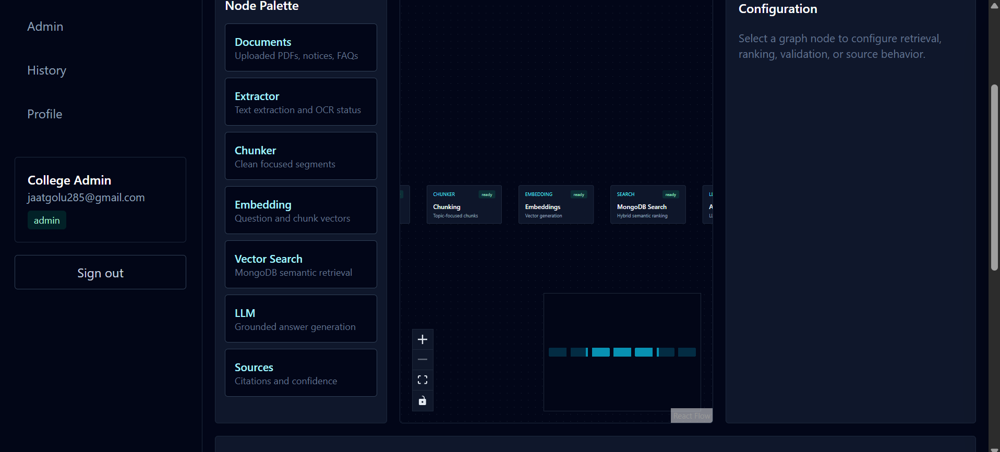
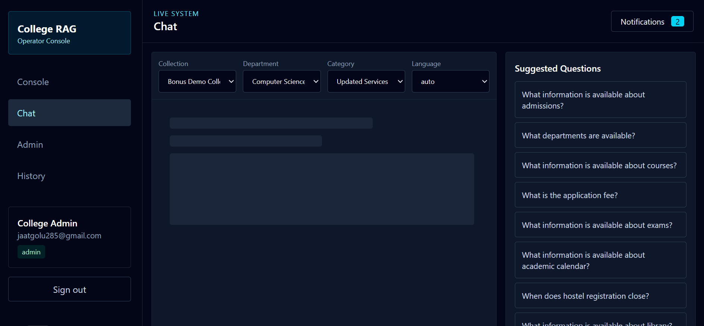
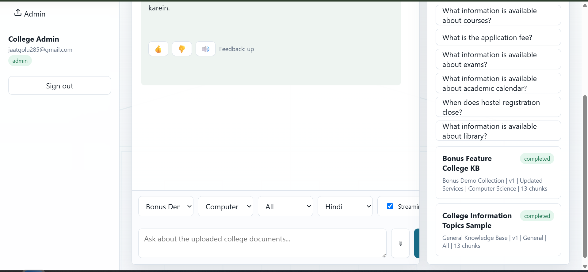

# RAG-Based College Chatbot

## 1. Project Name

RAG-Based College Chatbot

## 2. Problem Statement

Students often need quick, reliable answers about admissions, departments, courses, fees, exams, hostel facilities, scholarships, placements, policies, and events. College information is usually scattered across PDFs, notices, FAQs, and web pages, which makes it hard to find the correct answer quickly.

This project solves that problem with an AI-powered college information assistant. It uses Retrieval-Augmented Generation (RAG), so answers are generated from uploaded college documents instead of relying only on a general chatbot model.

## 3. Features

- Student and admin authentication.
- Protected routes and role-based admin access.
- College document upload for PDFs, text, Markdown, CSV, JSON, and HTML.
- Document text extraction, cleaning, chunking, and processing.
- Embedding generation for uploaded document chunks.
- MongoDB-backed vector-style semantic search.
- RAG pipeline: user question -> embedding -> retrieval -> context -> answer.
- AI-generated answers based on retrieved college knowledge-base content.
- Source/reference display with relevance scores.
- Unknown-question handling when relevant context is unavailable.
- Chat history and conversation export.
- Admin document management with upload, update, delete, and reprocess support.
- Admin analytics and answer feedback.
- Suggested questions and generated FAQs.
- Multiple collections and department-wise knowledge-base filtering.
- Document version metadata and automatic document summaries.
- OCR status tracking for uploaded documents.
- Hybrid keyword and semantic retrieval logic.
- Streaming chat API endpoint.
- Responsive React UI with Tailwind CSS.
- Dark and light themes.
- React Flow workflow graph with animated edges, drag-from-palette node creation, and node configuration panel.
- Live execution timeline with planner, execution, validation, recovery, and monitoring agent badges.
- Notifications drawer in the AppShell.

## 4. Technology Stack

- Frontend: React, Vite, Tailwind CSS, React Flow.
- Backend: Node.js, native HTTP server, serverless-compatible Vercel API handler.
- Database: MongoDB Atlas.
- Authentication: JWT-style signed tokens with password hashing.
- Document Processing: Node.js file processing and optional Python PDF extraction.
- AI/RAG: Local embedding and retrieval pipeline with optional OpenAI answer generation.
- Deployment: Vercel.
- Version Control: Git and GitHub.

## 5. Screenshots

### Workflow Console



### Chat Section



### Light Theme Chat



## 6. Live Demo

[https://rag-based-college-chatbot-one.vercel.app](https://rag-based-college-chatbot-one.vercel.app)

## 7. Backend

The backend is deployed with the same Vercel application as serverless API routes.

API base URL:

[https://rag-based-college-chatbot-one.vercel.app/api](https://rag-based-college-chatbot-one.vercel.app/api)

Example API routes:

- `POST /api/auth/register`
- `POST /api/auth/login`
- `GET /api/auth/me`
- `POST /api/documents/upload`
- `GET /api/documents`
- `POST /api/chat/ask`
- `POST /api/chat/stream`
- `GET /api/chat/sessions`
- `GET /api/admin/analytics`

## 8. Setup Instructions

Clone the repository:

```bash
git clone https://github.com/Golu-Jaat/RAG-Based-College-Chatbot.git
cd RAG-Based-College-Chatbot
```

Install dependencies:

```bash
npm install
```

Create a local environment file:

```bash
cp .env.example .env
```

Update `.env` with your own MongoDB Atlas URI, JWT secret, admin credentials, and optional OpenAI API key.

Check MongoDB connection:

```bash
npm run check:mongo
```

Run locally:

```bash
npm run dev
```

Open the app:

```text
http://localhost:3000
```

Build the frontend manually:

```bash
npm run build:client
```

Start the production-style local server:

```bash
npm start
```

## 9. Environment Variables

Required or supported environment variable names:

- `PORT`
- `JWT_SECRET`
- `MONGODB_URI`
- `MONGODB_DB`
- `ADMIN_NAME`
- `ADMIN_EMAIL`
- `ADMIN_PASSWORD`
- `OPENAI_API_KEY`
- `OPENAI_MODEL`
- `PYTHON_BIN`

Do not commit real API keys, passwords, OAuth secrets, access tokens, MongoDB credentials, or other sensitive values to GitHub. Keep actual values only in local `.env` files or deployment environment settings.
